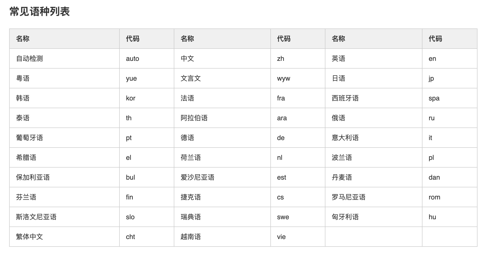

# webpack-in-loader
一键式实现项目的国际化语言包处理，支持 Vue2、Vue3，兼容 Webpack 和 Vite 构建工具

---


## 概览

vue-i18n版本的wepback loader，给出一个简单的demo。

*HTML*

```html
<div>你好，世界</div>
```

*资源文件*

```javascript
//zh.js
module.exports = {
  "a018615b35588a01": "你好，世界" //key是根据中文生成16的MD5
}

//en.js
module.exports = {
  "a018615b35588a01": "Hello, world" //key是根据中文生成16的MD5
}
```

*页面在中文下展示为*

你好世界

*在英文下展示为*

Hello, world

## 介绍

该loader的主要目的是将国际化资源与项目代码分离维护，这样我们去查找对应文案的时候更加简单方便，如上述demo所示，我们原文件中不需要去使用 `<div>{{ $t('a018615b35588a01') }}</div>` 的方式去显示声明国际化，通过loader自动进行替换完成我们的国际化工作，这样对开发查找页面文案之类带来了极大的方便。本组件还支持在vue的props中以及单独的js文件中进行国际化处理。

## 安装

```bash
npm i webpack-in-loader --save-dev

yarn add webpack-in-loader --dev
```

## 使用

本组件分为两部分：
1. **CLI 工具**：用于生成国际化资源文件和自动翻译
2. **构建工具集成**：
   - Webpack Loader：适用于 Webpack 构建的项目
   - Vite 插件：适用于 Vite 构建的项目（v2.0.0+）

建议在打包测试/上线前执行 CLI 命令生成资源文件，然后配置到 vue-i18n 上使用。

### cli的使用

cli可使用的所有命令

#### 自动抓取中文

项目根目录执行
```bash
npx i18n generate [src]
对src目录下的vue/js/ts/tsx/jsx文件进行中文提取并生成国际化资源文件
默认src目录   src  默认值为src
```

```bash
npx i18n generate -h
Usage: i18n generate [src]

对src目录下的vue/js/ts/tsx/jsx文件进行中文提取并生成国际化资源文件，默认src为执行目录下的src目录

Options:
  -p, --filepath <filepath>  设置国际化文件的路径，默认为执行目录下的src/locale目录，请务必设置一个单独的目录来放置国际化资源文件
  -f, --filename <filename>  设置生成文件的文件名，默认为 zh，会自动添加.js 后缀
  -h, --help                 output usage information
```

请务必记住上述的国际化资源文件的路径和文件名，loader中需要配置，若未设置采用默认，loader中也可以不用设置

#### 自动翻译
根据 `mode` 配置选择翻译方式：支持百度翻译和 AI 翻译两种方式，`mode` 未设置则使用默认项（百度翻译）。

```bash
npx i18n init 
初始化翻译配置项（如已有配置项，不要重复执行，不然会覆盖）

npx i18n translate [code]
开始翻译文件 
默认中文翻译成英文   code  默认值为en

Options:
  -f, --file <filename>,  选择翻译的文件，默认选取目录下的src/locale目录下的文件
```
code必须为百度翻译文档上的code值


初始化项目，生成的配置文件 i18n-config.js
```javascript
module.exports = {
    dir: "./src/locale/", // 目标目录
    file: 'zh.js', // 翻译的文件
    distLangs: ['en'], // 要翻译的语言
    open: true, // leader是否启用 默认true
    mode: 'Baidu', // 翻译方式: Baidu=百度翻译 | chatGPT/AI=AI翻译(兼容所有OpenAI兼容接口)
    appId: '', // 百度翻译appid
    secret: '', // 百度翻译密钥
    openAiKey: '', // AI翻译密钥 (兼容旧配置)
    aiKey: '', // AI翻译密钥 (优先级高于 openAiKey)
    aiModel: '', // AI模型名称，不填默认 gpt-3.5-turbo
    aiBaseUrl: '', // AI服务API地址，不填默认 OpenAI官方地址
    singleNum: 3000, //百度翻译单次请求最长次数 可配置范围（3900 - 600）不填则为默认值 1500
};
```

**AI 翻译支持的模型和厂商示例：**

| 厂商 | aiModel | aiBaseUrl |
|---|---|---|
| OpenAI (GPT-4) | `gpt-4` | 不填 |
| OpenAI (GPT-3.5) | `gpt-3.5-turbo` | 不填 |
| DeepSeek | `deepseek-chat` | `https://api.deepseek.com/v1` |
| 通义千问 | `qwen-turbo` | `https://dashscope.aliyuncs.com/compatible-mode/v1` |
| Moonshot/Kimi | `moonshot-v1-8k` | `https://api.moonshot.cn/v1` |
| 智谱 GLM | `glm-4` | `https://open.bigmodel.cn/api/paas/v4` |

> 凡是支持 OpenAI ChatGPT 接口格式的 AI 服务商均可使用，只需填入对应的 `aiModel` 和 `aiBaseUrl`。

**AI 翻译配置示例：**

```javascript
// 使用 DeepSeek 翻译
module.exports = {
    mode: 'chatGPT', // 或任意非 Baidu 值
    aiKey: 'your-deepseek-api-key',
    aiModel: 'deepseek-chat',
    aiBaseUrl: 'https://api.deepseek.com/v1',
};

// 继续使用旧版 openAiKey 配置（仍兼容）
module.exports = {
    mode: 'chatGPT',
    openAiKey: 'your-api-key', // 自动使用 gpt-3.5-turbo
};
```

对应翻译语言代码




百度翻译文档：https://fanyi-api.baidu.com/product/113


#### 人工修改翻译导入
人工审核百度翻译错误的语言包，可直接在map映射表内修改，执行以下命令重新生成语言包

```bash
npx i18n init 
初始化翻译配置项（如已有配置项，不要重复执行，不然会覆盖）

npx i18n transform
开始遍历所有map文件，并导入对应语言包内
```


#### 清理语言包
```bash
npx i18n init 
初始化翻译配置项（如已有配置项，不要重复执行，不然会覆盖）

npx i18n clear 
清理语言包内已无效的值（使用频率：建议半年或一年以上，用于清理已无用的语言包）
```

### 跳过中文抓取
js文件和vue文件内被<i18n-ignore (跳过的内容) i18n-ignore>  包括的内容将不会进行抓取

使用实例
js语法
```bash
// <i18n-ignore
const str = "我的世界"
// i18n-ignore>
```
template内使用
```bash
<!-- <i18n-ignore -->
<div>我的世界</div>
<!-- i18n-ignore> -->
```

### loader的使用

loader中需要对两个部分进行配置，一个是vue文件，一个是js文件。

```javascript
const path = require('path');

module.exports = {
  //其他配置
  module:{
    rules:[
      {
        test: /\.vue$/,
        use: [
          {
            loader: 'vue-loader',
          },
          {
            loader: 'webpack-in-loader', //一定要作为第一个loader
            options:{
              localeFile: path.join(process.cwd(), 'src/locale/zh.js') //与cli中相同，若生成的时候保持默认，则不需要配置
            }
          }
        ]
      },
      {
        test: /\.(jsx|js|ts|tsx)?$/,
        include: [resolve('src')],
        use:[
          {
            loader: 'babel-loader',
          },
          {
            loader: 'webpack-in-loader', //一定要作为第一个loader
            options:{
              localeFile: path.join(process.cwd(), 'src/locale/zh.js') //与cli中相同，若生成的时候保持默认，则不需要配置
            }
          }
        ]
      },
    ]
  }
}
```

### Vite 插件的使用

从 2.0.0 版本开始，支持在 Vite 项目中使用。

#### 1. 引入插件

在 `vite.config.js` 或 `vite.config.ts` 中引入并配置插件：

```javascript
import { defineConfig } from 'vite';
import vue from '@vitejs/plugin-vue';
import { vitePluginI18n } from 'webpack-in-loader/vite';

export default defineConfig({
  plugins: [
    vue(),
    vitePluginI18n()
  ]
});
```

#### 2. 创建配置文件

在项目根目录创建 `i18n-config.js`：

```javascript
module.exports = {
  dir: './src/locale/',  // 语言包目录
  file: 'zh.js',         // 语言包文件名
  open: true             // 是否启用插件
};
```

#### 3. 功能特性

- 自动转换 `.vue`、`.js`、`.jsx`、`.ts`、`.tsx` 文件中的中文
- 支持语言包文件热更新，修改语言包后自动刷新页面
- 自动排除 `node_modules` 和语言包目录

#### 4. 开发示例

可以参考项目中的示例：
- `examples/vite-vue2/` - Vue 2 + Vite 示例
- `examples/vite-vue3/` - Vue 3 + Vite 示例

更多 Vite 插件详细说明，请查看 [VITE_PLUGIN_README.md](./VITE_PLUGIN_README.md)

### 国际化资源配置

此处一定要注意！！！否则是个坑。

国际化的配置一定一定要在所有逻辑之前，建议采用 i18n.js 文件单独配置，然后在入口文件最先引入这个文件即可！
要确保（'@/i18n'）这个路径可以取到i18n对象

vue2版本 
```javascript
//i18n.js 国际化配置文件
import Vue from 'vue';
import VueI18n from 'vue-i18n';
Vue.use(VueI18n);
const i18n = new VueI18n({
    locale: 'zh',
    messages:{
      'zh': ...require('./locale/zh'),
    },
});
export default i18n;

//main.js 入口文件
import i18n from '@/i18n';

```

vue3版本 
```javascript
//i18n.js 国际化配置文件
import { createI18n } from "vue-i18n";

const i18n = createI18n({
    locale: "zh", //默认显示的语言
    messages:{
      'zh': ...require('./locale/zh'),
    },
});

export default i18n;

//main.js 入口文件
import i18n from '@/i18n';

```


## 注意

- 建议字符串的连接用模板字符串方式，这样其中涉及到的一些动态参数也会自动生成 {0} {1} 这样的参数注入


## 变更日志
每个版本的详细更改都记录在[版本说明](https://github.com/hujinbin/webpack-i18n-loader/blob/master/CHANGELOG.md)中。

